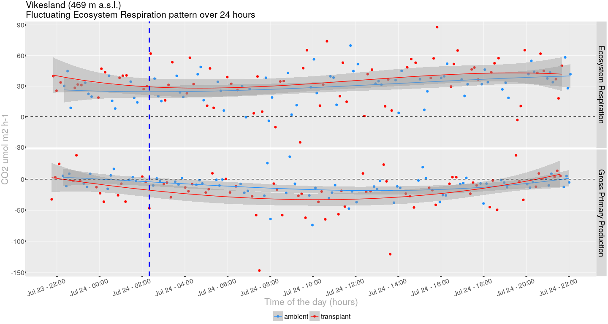

Group report
================
Group 4
2022-08-02

# Cleaning

## Fluxes

A flux that requires cleaning:

A flux that does not require cleaning:

## PAR values

Problems with PAR values during ER measurements:

Problems corrected. The negative PAR values were replaced by 0 (because
it is ER):

# Calculations

## Fluxes

Where:

-   flux: the flux of CO2 at the surface of the plot
    (mol
    m-2 s-1)
-   slope: slope of linear regression fitting the CO2
    concentration versus time
    (mol
    mol-1)
-   P: pressure, assumed 1 atm
-   V: volume of the chamber and tubing (L)
-   R: gas constant (0.082057 L atm K-1 mol-1)
-   T: chamber air temperature (K)
-   A: area of chamber frame base (m2)

## Gross primary productivity

GPP = NEE - ER

# Figures

## Vikesland

Fluxes over 24 hours at Vikesland (data not fully cleaned yet, might
need some more work).

# Data dictionaries

## Fluxes

| Variable name | Description                                                              | Variable type | Variable range or levels                                                                                                        | Unit           | How measured                                                                 |
|:--------------|:-------------------------------------------------------------------------|:--------------|:--------------------------------------------------------------------------------------------------------------------------------|:---------------|:-----------------------------------------------------------------------------|
| turfID        | The ID of the plot of the carbon flux measurement                        | categorical   | 85 WN1C 162, 105 WN3C 173, 158 WN2C 199, TTC 146, TTC 140, TTC 141, TTC 101, TTC 110, TTC 115, 4 AN1C 4, 27 AN3C 27, 77 AN2C 77 | NA             | defined                                                                      |
| type          | Types of the data that were collected with (ER) and without tarps (NEE). | categorical   | ER, NEE, GPP                                                                                                                    | NA             | defined                                                                      |
| flux          | The value of the measured carbon flux                                    | numeric       | -212.288 - 126.234                                                                                                              | mmol/sqm/h     | calculated                                                                   |
| temp_soil     | The mean of the soil temperature in the outer plot.                      | numeric       | 0.825 - 21.608                                                                                                                  | celsius        | Automatically measured by the thermal sensor and recorded to the data logger |
| PARavg        | The mean of the Photosynthetic Active Radiation (PAR) value              | numeric       | -2.819 - 1818.049                                                                                                               | micromol/s/sqm | Automatically measured by the PAR sensor and recorded to the data logger     |
| datetime      | Date and time of the measured carbon flux                                | date_time     | 2022-07-23 21:45:15 - 2022-07-31 08:12:45                                                                                       | NA             | defined                                                                      |
